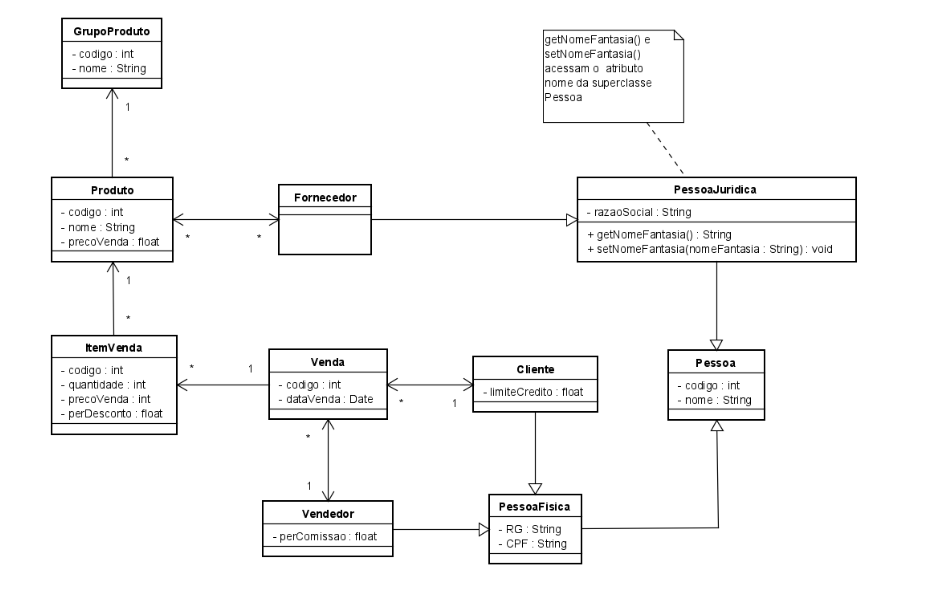

# Exercício mapeamento JPA
Exercício da disciplina de Linguagem de Programação 2 

## TO-DO
- [ ] dockerizar projeto
- [ ] dockerizar postgresql
- [ ] adicionar script para criação do banco
- [ ] adicionar _docker compose_ para iniciar o banco
- [ ] reproduzir para a branch com herança 

## Tecnologias utilizadas
| Nome           | Versão       |
|----------------|--------------|
| Java           | 11           |
| Hibernate-core | 5.4.2.Final  |
| Postgresql     | 42.2.14.jre7 |
| Lombok         | 1.18.12      |

## Implementações necessárias

## Diagrama de entidades

